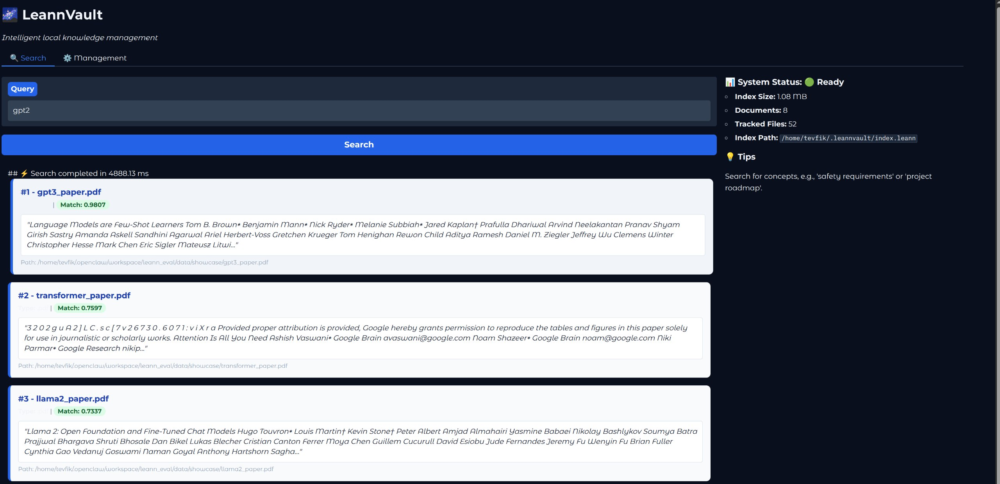

# LeannVault

[](https://github.com/tevfik/LeannVault/actions/workflows/ci.yml)
[](https://opensource.org/licenses/MIT)

A lightweight, hash-based vector search application that keeps your document index valid even when files are moved. Built on LEANN for 97%+ storage efficiency.

## Features

- **Hash-Based Tracking**: Files are tracked by content hash, not path. Move files freely without breaking the index.
- **SQLite Metadata Store**: Internal database maps file hashes to current paths.
- **Semantic Search**: Fast, accurate vector search using LEANN's HNSW backend.
- **Universal Text Extraction**: Powered by Microsoft's [markitdown](https://github.com/microsoft/markitdown) for broad format support.
- **CLI Interface**: Full command-line control with `sync`, `index`, `search`, and `delete` commands.
- **Web UI**: Lightweight FastAPI + Gradio interface for interactive searching.
- **99% Storage Savings**: LEANN's compression keeps indexes tiny.

## UI Showcase



## Installation

```bash
# Clone and install
git clone https://github.com/tevfik/LeannVault.git
cd LeannVault
pip install -e .
```

## Quick Start

### CLI Usage

```bash
# Sync: Scan directory and update path mappings
leannvault sync /path/to/documents

# Index: Add new files to the index
leannvault index /path/to/new/files

# Search: Semantic search across indexed documents
leannvault search "your query here" --top-k 5

# Delete: Remove documents from index
leannvault delete --hash <file-hash>
```

### Web UI

```bash
# Start the web server
leannvault serve --port 8000

# Open http://localhost:8000 in your browser
```

## Project Structure

```
leannvault/
├── src/leannvault/
│   ├── __init__.py
│   ├── core/
│   │   ├── __init__.py
│   │   ├── tracker.py      # Hash-based tracking with SQLite
│   │   ├── indexer.py      # LEANN indexing logic
│   │   └── searcher.py     # Search functionality
│   ├── cli/
│   │   ├── __init__.py
│   │   └── main.py         # CLI commands
│   └── web/
│       ├── __init__.py
│       ├── api.py          # FastAPI endpoints
│       └── ui.py           # Gradio interface
├── data/
│   ├── index/              # LEANN index files
│   └── vault/              # SQLite database
├── pyproject.toml
└── README.md
```

## How It Works

### Hash-Based Tracking

1. When a file is indexed, its content hash (SHA-256) is computed
2. The hash is stored in SQLite with the current file path
3. On `sync`, the system checks if paths still exist
4. If a file moved, the hash lookup finds it by content, not path
5. Search results include the current (updated) file path

### Supported File Types

Powered by Microsoft's **markitdown** library for universal text extraction:

| Format | Extensions |
|--------|-----------|
| PDF | `.pdf` |
| Word | `.docx`, `.doc` |
| PowerPoint | `.pptx`, `.ppt` |
| Excel | `.xlsx`, `.xls` |
| HTML | `.html`, `.htm` |
| Email (Office 365) | `.json` (custom extraction) |

Additional formats may be supported by markitdown. The system gracefully falls back to alternative extraction methods if markitdown is unavailable.

## Configuration

Configuration defaults to the following paths:

- **Index**: `~/.leannvault/index.leann`
- **Database**: `~/.leannvault/vault.db`
- **Model**: `facebook/contriever` (default)

## Development

```bash
# Install dev dependencies
pip install -e ".[dev]"

# Run linting
flake8 src

# Build package
python -m build

# Run tests
pytest tests/
```

### CI/CD Pipeline

LeannVault uses GitHub Actions for:
- **Linting**: Automated code quality checks with `flake8`.
- **Building**: Automated creation of source distributions and wheels.
- **Releases**: Automatic deployment of build artifacts to GitHub Releases when a version tag (e.g., `v1.0.0`) is pushed.

## License

MIT License
